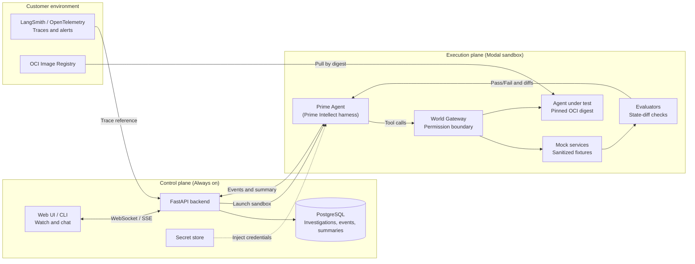
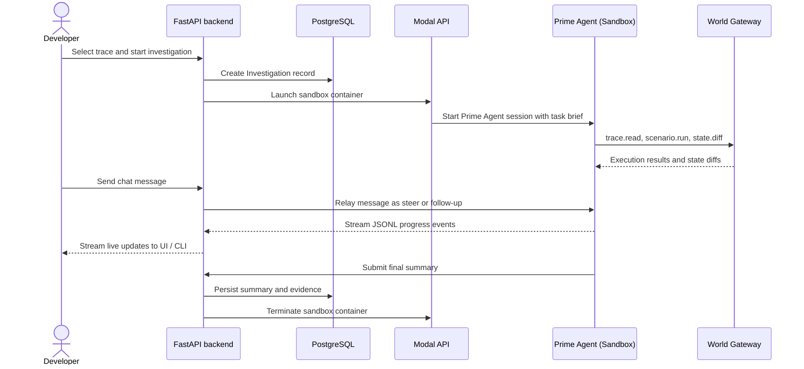

# Simulate Architecture

This document describes the technical architecture of Simulate, how the control plane and execution plane communicate, and how sandboxes run investigations.

For milestone scopes and delivery requirements, see [`BUILD_ROADMAP.md`](file:///Users/king/Desktop/simulate/BUILD_ROADMAP.md).

## 1. Product overview

Simulate provides isolated, resettable copies of business environments to investigate agent failures and test agent updates before production release.

Simulate performs two primary tasks:

1. **Investigate a failure:** Reproduce a production error in a disposable sandbox, identify why the error occurred, and generate a written evidence summary.
2. **Test a change:** Run baseline and candidate agent configurations (prompts, models, tools, or routing) across repeatable scenarios to measure performance changes.

### Measured outcomes

Simulate measures agent performance using objective metrics rather than generic ratings:

- **Tool execution:** Correct tool selection and reduced tool errors.
- **Efficiency:** Token consumption and turn counts per task.
- **Escalation policy:** Timely escalation to human reviewers according to business rules.
- **Task completion:** Verified final state matches expected database invariants.
- **Cost:** Monetary cost per successful task.

### Core investigation loop

```text
Production alert or selected trace
  -> Spin up a scoped sandbox environment
  -> Investigation agent reproduces and debugs the issue
  -> Developer watches progress and steers the agent over live chat
  -> Final evidence summary is saved to PostgreSQL
```

### System boundaries

- **No live production access:** Sandboxes run with synthetic fixtures, sanitized database state, and mock external services.
- **Human approval required:** Human operators approve world models, business rules, and external actions.
- **Immutable evidence:** Every run persists an append-only event log, state diffs, evaluator outputs, and a final written summary.

---

## 2. System planes

Simulate separates long-term data storage from ephemeral compute:



### Control plane (Always on)

The control plane stores organizations, projects, workflows, traces, event logs, and evidence summaries. It runs as a FastAPI service with a PostgreSQL database. The web interface and CLI communicate only with the control plane.

### Execution plane (Disposable sandboxes)

The execution plane runs ephemeral workloads. Each investigation runs inside an isolated cloud container (a Modal sandbox). The sandbox destroys itself after the investigation finishes.

The runner interface is provider-neutral. While Modal is the primary runner for Phase 8, the interface supports future VM backends (such as Hetzner or customer-provided VMs) without changing control-plane code.

---

## 3. Lifecycle of an investigation

The following sequence shows how an investigation runs from alert intake to final summary:



### Live chat and event streaming

Inside the sandbox, a lightweight runner bridge listens for incoming control-plane messages. The runner relays messages to Prime Agent's RPC interface:

- `prompt`: Starts a new investigation turn.
- `steer`: Adjusts the agent's behavior during an active turn.
- `follow_up`: Queues a question for the next turn.

Prime Agent emits JSONL events as it works. The runner bridge streams these events to the FastAPI backend, which saves them to PostgreSQL and broadcasts them to clients over WebSocket or Server-Sent Events (SSE).

---

## 4. Business world models and environment slices

A business world model is an executable representation of a business workflow.

### World model components

- **Actors and roles:** Customers, agents, approvers, and external systems.
- **Rules and policies:** Business constraints (for example: *"Refunds over $500 require manager approval"*).
- **Tool contracts:** Declarative schemas for all tools and APIs used in the workflow.
- **Fixture state:** Anonymized, structurally accurate database fixtures.

### Environment slices

An investigation does not load the entire business world. It loads an **environment slice** containing only the resources required for the target scenario. For example, a refund investigation loads only the customer record, the order record, the refund policy, and a mocked payment gateway.

### World Gateway

The World Gateway is an in-sandbox proxy that enforces permission boundaries:

- **Egress filtering:** Outbound network connections outside the sandbox are denied by default.
- **Scoped access:** The agent under test can reach only mock services registered in its slice.
- **Audit trail:** All tool calls and responses pass through the gateway and are recorded as evidence.

---

## 5. Inside the sandbox container

Each Modal sandbox builds from two layers:

| Layer | Contents |
| --- | --- |
| **Simulate base image** | Prime Agent (Prime Intellect harness), runner bridge, World Gateway, mock services, and fixture data. |
| **Customer artifact** | The agent under test, pulled by an immutable `sha256` OCI image digest. |

### Prime Agent tool permissions

Prime Agent has access to specific investigation tools and is blocked from production actions:

- **Allowed tools:** `trace.read`, `world.describe`, `environment.status`, `scenario.run`, `state.inspect`, `state.diff`, `evidence.read`, `proposal.create`, `summary.submit`.
- **Forbidden actions:** Modifying approved rules, altering tool permissions, connecting to production systems, reading customer credentials, deleting evidence, or managing sandbox lifecycles.

### Agent under test contract

Customer agents must implement a standardized interface:

- **Image:** OCI container image referenced by immutable content digest (`sha256:...`).
- **Endpoint:** `POST /turn` accepting `{"conversation_id": "...", "message": "...", "context_version": "..."}` and returning `{"reply": "...", "tool_calls": [...], "state_refs": [...]}`.
- **Configuration:** Base URLs and service keys injected through environment variables.
- **Egress:** All external requests routed through the World Gateway.

### Credential handling

Customer model credentials are stored securely in the control plane's secret store. When a sandbox launches, the control plane injects credentials into the container environment. Credentials are never written to event logs, database records, or evidence summaries.

---

## 6. Core domain models


---

## 7. Implementation map

| Component | Code location |
| --- | --- |
| Trace ingestion and normalization | [`src/app/domain/evidence/`](file:///Users/king/Desktop/simulate/src/app/domain/evidence/) |
| Reviewed bundle compiler | [`src/app/domain/bundle/`](file:///Users/king/Desktop/simulate/src/app/domain/bundle/) |
| Isolated database provisioning | [`src/app/domain/simulation/provisioner.py`](file:///Users/king/Desktop/simulate/src/app/domain/simulation/provisioner.py) |
| Reference simulation runner | [`src/app/domain/simulation/runner.py`](file:///Users/king/Desktop/simulate/src/app/domain/simulation/runner.py) |
| User simulator CLI and Textual UI | [`src/app/domain/user_simulator/`](file:///Users/king/Desktop/simulate/src/app/domain/user_simulator/) |
| Investigation service (Phase 8 MVP) | [`src/app/domain/investigation/`](file:///Users/king/Desktop/simulate/src/app/domain/investigation/) |
| Cloud runner and Modal adapter (Phase 8 MVP) | [`src/app/domain/runner/`](file:///Users/king/Desktop/simulate/src/app/domain/runner/) |

---

## 8. Market study summary (August 2026)

| Platform | Category | Relationship to Simulate | Key difference |
| --- | --- | --- | --- |
| **Replicas** | Cloud coding-agent VMs | Adjacent | Provides developer VMs for code generation; does not simulate business environments or evaluate agent workflows. |
| **Moda** | Agent evaluation platform | Closest comparison | Replays scenarios using prompt-based LLM judges; does not execute agents against live tool contracts, databases, or mock APIs. |
| **Limrun** | Mobile cloud simulators | Adjacent | Runs iOS/Android simulators to verify mobile agents; demonstrates the value of running agents in realistic environments. |
| **LangSmith / OpenTelemetry** | Observability and tracing | Upstream integration | Detects production anomalies and stores raw traces; Simulate ingests these traces to reproduce and fix issues. |

---

## 9. Glossary

- **Business world:** Versioned description of actors, business rules, tool contracts, and fixture state for a process.
- **Environment slice:** The minimum subset of a business world required to run a specific scenario.
- **Investigation:** A single test run: trace reference, environment slice, investigator agent, agent under test, and evidence trail.
- **Prime Agent:** An autonomous coding and investigation harness developed by Prime Intellect, used to investigate failures.
- **Runner bridge:** The in-container daemon that relays messages between the control plane and Prime Agent's RPC interface.
- **World Gateway:** The in-container proxy that enforces permission boundaries and logs all tool interactions.
- **Evidence:** Immutable logs, state diffs, evaluator checks, and written summaries generated by an investigation.

