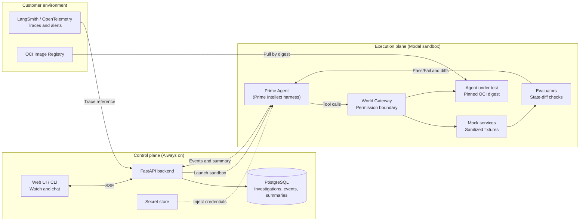
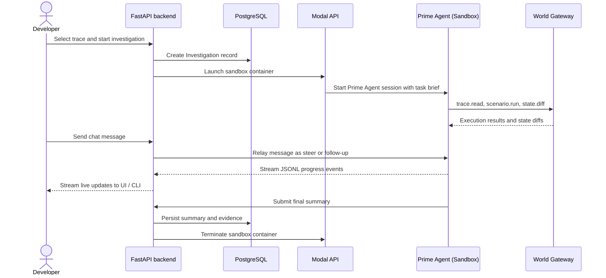
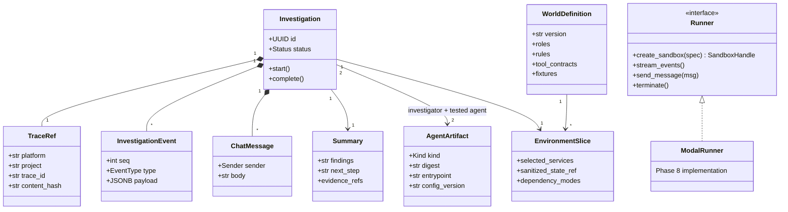

# Simulate Architecture

This document describes the technical architecture of Simulate, how the control plane and execution plane communicate, and how sandboxes run investigations.

**Status:** The Phase 8 MVP is complete: merged to `main` in merge commit `7b3c01a` (August 23, 2026; Linear THE-18) and verified live against a real Modal sandbox on August 26, 2026. The full Phase 8 business world compiler and experiment engine remain in progress (roadmap sub-phases 8.0 through 8.8).

For milestone scopes and delivery requirements, see [`BUILD_ROADMAP.md`](file:///Users/king/Desktop/simulate/BUILD_ROADMAP.md).

## 1. Product overview

Simulate provides isolated, resettable copies of business environments. Teams use Simulate to investigate agent failures and test agent updates before releasing code to production.

Simulate performs two primary tasks:

1. **Investigate a failure:** Reproduce a production error in a disposable sandbox, identify why the error occurred, and generate a written evidence summary.
2. **Test a change:** Run baseline and candidate agent configurations (prompts, models, tools, or routing) across repeatable scenarios to measure performance changes.

### Measured outcomes

Simulate measures agent performance using objective metrics rather than generic ratings:

- **Tool execution:** Correct tool selection and reduced tool errors.
- **Efficiency:** Token consumption and turn counts per task.
- **Escalation policy:** Timely escalation to human reviewers according to business rules.
- **Task completion:** Verified final state matching expected database invariants.
- **Cost:** Monetary cost per successful task.

### Core investigation loop

```text
Production alert or selected trace
  -> Spin up a scoped sandbox environment
  -> Investigation agent reproduces and debugs the issue
  -> Developer watches progress and steers the agent over live chat
  -> Final evidence summary is saved to PostgreSQL
```

### System boundaries

- **No live production access:** Sandboxes run with synthetic fixtures, sanitized database state, and mock external services.
- **Human approval required:** Human operators approve world models, business rules, and external actions.
- **Immutable evidence:** Every run persists an append-only event log, state diffs, evaluator outputs, and a final written summary.

---

## 2. System planes

Simulate separates long-term data storage from ephemeral compute.



### Control plane (Always on)

The control plane stores organizations, projects, workflows, traces, event logs, and evidence summaries. It runs as a FastAPI service with a PostgreSQL database. The web interface and CLI communicate only with the control plane.

### Execution plane (Disposable sandboxes)

The execution plane runs ephemeral workloads. Each investigation runs inside an isolated cloud container using a Modal sandbox. The sandbox destroys itself after the investigation finishes.

The runner interface is provider-neutral. While Modal is the primary runner for Phase 8, the interface supports future VM backends without changing control plane code.

---

## 3. Lifecycle of an investigation

The following sequence shows how an investigation runs from alert intake to final summary:



### Live chat and event streaming

Inside the sandbox, a runner bridge daemon listens for incoming control plane messages. The runner relays messages to Prime Agent through its RPC interface:

- `prompt`: Starts a new investigation turn.
- `steer`: Adjusts agent behavior during an active turn.
- `follow_up`: Queues a question for the next turn.

Prime Agent emits JSONL events during execution. The runner bridge streams these events to the FastAPI backend. The backend persists the events to PostgreSQL and broadcasts them to clients over Server-Sent Events (SSE), with `Last-Event-ID` replay from PostgreSQL for reconnecting clients.

### Implemented Phase 8 MVP behavior

The Modal investigation MVP is implemented and live-verified as of August 26, 2026. This is what exists today:

- **In-sandbox bridge loop:** `SandboxBridge.run()` starts the World Gateway on loopback, then spawns `prime-agent --mode rpc --no-session`. It sends the task brief as the first typed `prompt` command, long-polls the control-plane inbox, relays `prompt`/`steer`/`follow_up` messages, reads Prime Agent stdout, maps official events to typed domain events, and batches them (at most 50 events or every 500 milliseconds) to `POST /internal/events`.
- **Typed RPC contract:** Commands use the official shape `{"type": "...", "message": "..."}`. Official `response` lines are filtered so they never become false domain events; a rejected command is a visible fatal error. The official `{"type":"abort"}` command is used by the watchdog.
- **Completion rule:** A run completes cleanly only after both a valid `summary.submit` (persisted exactly once) and the fresh `agent_end` corresponding to the current run have occurred. Failures emit a visible `error` event and clean up resources.
- **Binding tool watchdog:** The bridge tracks official `tool_execution_start`/`tool_execution_end` events by `toolCallId`. A tool execution that runs past the configured bridge tool timeout is aborted once via the official RPC `abort` command; a `warning` event is persisted; any stale `agent_end` is invalidated; and one bounded recovery steer asks Prime to submit its summary without retrying the timed-out operation. The watchdog fires on whichever comes first: the per-tool age, or the overall run cutoff the bridge derives from the injected sandbox lifetime (`SANDBOX_TIMEOUT_S` − recovery − reserve). The run cutoff covers tools that start late in the run (measured live: hung tool at ~140s of a 300s run) where per-tool age alone would leave no room to recover and flush before Modal kills the container; the recovery deadline is bounded to `SANDBOX_TIMEOUT_S` − reserve so flush and child cleanup fit. If a valid summary plus fresh `agent_end` does not arrive within the recovery timeout, the run fails deterministically rather than faking completion. Watchdog values flow from `Settings` through `SandboxSpec` into the container env (`TOOL_TIMEOUT_S`/`TOOL_RECOVERY_TIMEOUT_S`/`SANDBOX_TIMEOUT_S`) and into the bridge; `SandboxSpec` validation rejects budgets that cannot fit the outer lifetime.
- **Separated authority:** Control-plane authority (`BRIDGE_TOKEN`) and World Gateway authority (a per-run loopback `WORLD_GATEWAY_TOKEN` generated in the bridge) are separate. Prime Agent receives only `WORLD_GATEWAY_TOKEN`. Prime Agent launches under a deliberately sanitized child environment (`build_child_env()`) that passes only runtime basics, model-provider credentials, and gateway wiring — `BRIDGE_TOKEN`, `CONTROL_PLANE_CALLBACK_URL`, task/control-plane data, database credentials, and unrelated secrets are excluded. This prevents Prime/IPython from reaching the control-plane endpoints directly.
- **World Gateway:** A loopback FastAPI service exposing exactly nine approved tool routes with Bearer-token authentication. A Prime Agent extension (`world_gateway.ts`) registers the tools under identifier-safe aliases, calls the gateway over loopback HTTP with a bounded per-call timeout, and returns sanitized results without exposing the token, environment, or headers. The gateway context carries only truthful metadata the bridge can prove; state, evidence, and diff data that is not compiled returns an explicit unavailable result instead of invented defaults.
- **Event transport:** The control plane streams persisted events to CLI and API clients over Server-Sent Events (SSE), not WebSocket.
- **Security boundary:** The World Gateway binds to `127.0.0.1`. Modal enforces an explicit outbound domain allowlist that must include the control-plane host and the model-provider host. Caller-supplied reserved environment and secret keys are rejected, and only a SHA-256 hash of the bridge token is persisted.
- **Model credentials:** The verified live path maps standard OpenAI or Anthropic credentials into the sandbox as `OPENAI_API_KEY` or `ANTHROPIC_API_KEY`. These provider credentials are propagated into the Prime child environment and remain visible to Prime/IPython; a provider proxy that keeps them out of the agent is future hardening. Prime Agent v0.8.1 requires a custom `models.json` for non-standard OpenAI-compatible providers, so custom `MODEL_BASE_URL` support is not part of the MVP.

The later Phase 8 target architecture in this document — the business world compiler, experiment engine, immutable candidate identity, and the full Textual experiment workspace (roadmap sub-phases 8.0 through 8.8) — is not implemented yet and remains in progress.

---

## 4. Business world models and environment slices

A business world model is an executable representation of a business workflow.

### World model components

- **Actors and roles:** Customers, agents, approvers, and external systems.
- **Rules and policies:** Business constraints (for example: *"Refunds over $500 require manager approval"*).
- **Tool contracts:** Declarative schemas for all tools and APIs used in the workflow.
- **Fixture state:** Anonymized, structurally accurate database fixtures.

### Environment slices

An investigation loads an **environment slice** containing only the resources required for the target scenario. For example, a refund investigation loads only the customer record, the order record, the refund policy, and a mocked payment gateway.

### World Gateway

The World Gateway is an in-sandbox proxy that enforces permission boundaries:

- **Egress filtering:** Outbound network connections outside the sandbox are denied by default.
- **Scoped access:** The agent under test can reach only mock services registered in its slice.
- **Audit trail:** All tool calls and responses pass through the gateway and are recorded as evidence.

---

## 5. Inside the sandbox container

Each Modal sandbox builds from two layers:

| Layer | Contents |
| --- | --- |
| **Simulate base image** | Prime Agent (Prime Intellect harness), runner bridge, World Gateway, mock services, and fixture data. |
| **Customer artifact** | The agent under test, pulled by an immutable `sha256` OCI image digest. |

### Prime Agent tool permissions

Prime Agent has access to specific investigation tools and is blocked from production actions:

- **Allowed tools:** `trace.read`, `world.describe`, `environment.status`, `scenario.run`, `state.inspect`, `state.diff`, `evidence.read`, `proposal.create`, `summary.submit`.
- **Forbidden actions:** Modifying approved rules, altering tool permissions, connecting to production systems, reading customer credentials, deleting evidence, or managing sandbox lifecycles.

### Agent under test contract

Customer agents must implement a standardized interface:

- **Image:** OCI container image referenced by immutable content digest (`sha256:...`).
- **Endpoint:** `POST /turn` accepting `{"conversation_id": "...", "message": "...", "context_version": "..."}` and returning `{"reply": "...", "tool_calls": [...], "state_refs": [...]}`.
- **Configuration:** Base URLs and service keys injected through environment variables.
- **Egress:** All external requests routed through the World Gateway.

### Credential handling

Customer model credentials remain in the secret store of the control plane. When a sandbox launches, the control plane injects credentials into the container environment. Credentials are never written to event logs, database records, or evidence summaries.

---

## 6. Core domain models



---

## 7. Implementation map

| Component | Code location |
| --- | --- |
| Trace ingestion and normalization | [`src/app/domain/evidence/`](file:///Users/king/Desktop/simulate/src/app/domain/evidence/) |
| Reviewed bundle compiler | [`src/app/domain/bundle/`](file:///Users/king/Desktop/simulate/src/app/domain/bundle/) |
| Isolated database provisioning | [`src/app/domain/simulation/provisioner.py`](file:///Users/king/Desktop/simulate/src/app/domain/simulation/provisioner.py) |
| Reference simulation runner | [`src/app/domain/simulation/runner.py`](file:///Users/king/Desktop/simulate/src/app/domain/simulation/runner.py) |
| User simulator CLI and Textual UI | [`src/app/domain/user_simulator/`](file:///Users/king/Desktop/simulate/src/app/domain/user_simulator/) |
| Investigation service (Phase 8 MVP) | [`src/app/domain/investigation/`](file:///Users/king/Desktop/simulate/src/app/domain/investigation/) |
| Cloud runner and Modal adapter (Phase 8 MVP) | [`src/app/domain/runner/`](file:///Users/king/Desktop/simulate/src/app/domain/runner/) |
| Runner bridge, Prime Agent link, and World Gateway (Phase 8 MVP) | [`src/app/domain/agent_runner/`](file:///Users/king/Desktop/simulate/src/app/domain/agent_runner/) |
| Investigation CLI commands | [`src/app/cli/investigate.py`](file:///Users/king/Desktop/simulate/src/app/cli/investigate.py) |

---

## 8. Market study summary (August 2026)

| Platform | Category | Relationship to Simulate | Key difference |
| --- | --- | --- | --- |
| **Replicas** | Cloud coding-agent VMs | Adjacent | Provides developer VMs for code generation. Does not simulate business environments or evaluate agent workflows. |
| **Moda** | Agent evaluation platform | Closest comparison | Replays scenarios using prompt-based LLM judges. Does not execute agents against live tool contracts, databases, or mock APIs. |
| **Limrun** | Mobile cloud simulators | Adjacent | Runs mobile simulators to verify mobile agents. Demonstrates the value of running agents in realistic environments. |
| **LangSmith / OpenTelemetry** | Observability and tracing | Upstream integration | Detects production anomalies and stores raw traces. Simulate ingests these traces to reproduce and fix issues. |

---

## 9. Glossary

- **Business world:** Versioned description of actors, business rules, tool contracts, and fixture state for a process.
- **Environment slice:** The minimum subset of a business world required to run a specific scenario.
- **Investigation:** A single test run containing a trace reference, environment slice, investigator agent, agent under test, and evidence trail.
- **Prime Agent:** An autonomous coding and investigation harness developed by Prime Intellect, used to investigate failures.
- **Runner bridge:** The in-container daemon that relays messages between the control plane and Prime Agent RPC interface.
- **World Gateway:** The in-container proxy that enforces permission boundaries and logs all tool interactions.
- **Evidence:** Immutable logs, state diffs, evaluator checks, and written summaries generated by an investigation.
